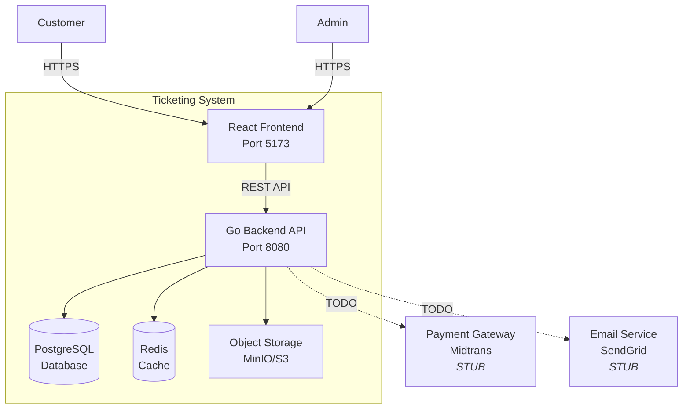
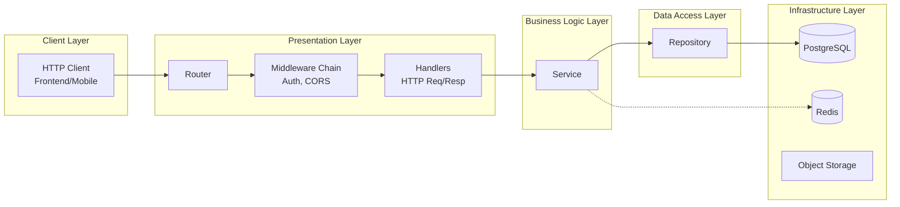
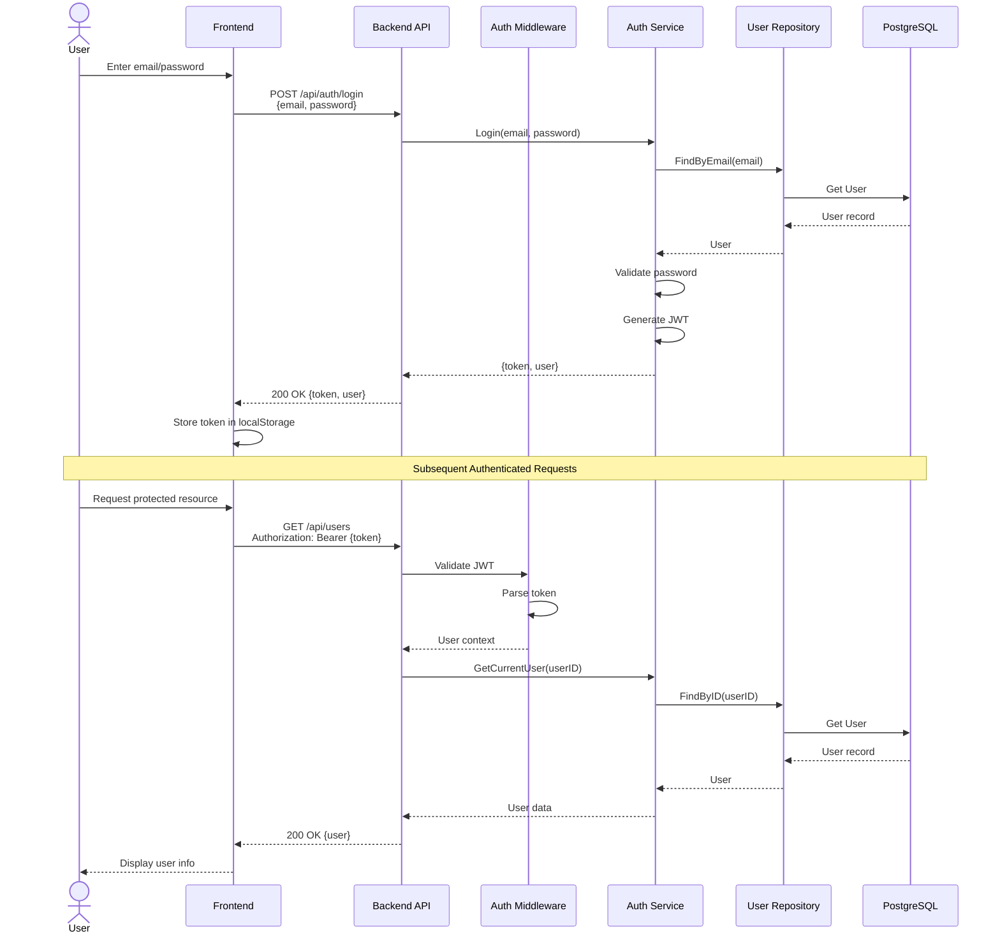
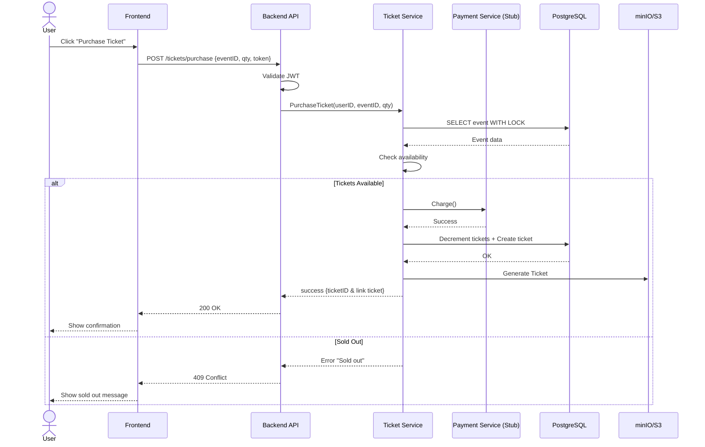
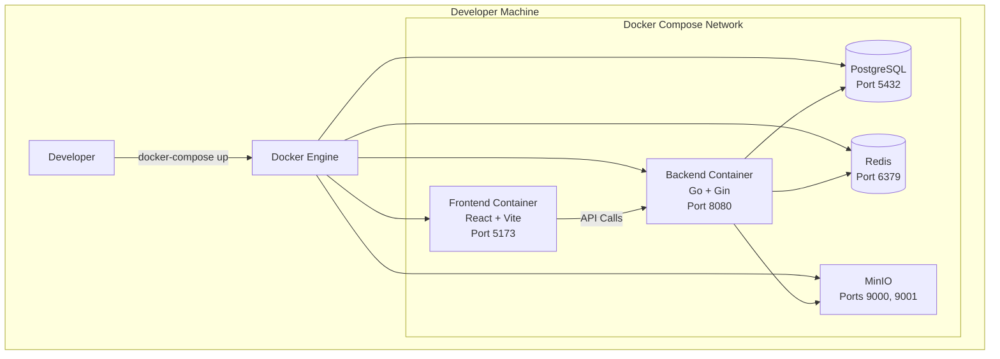
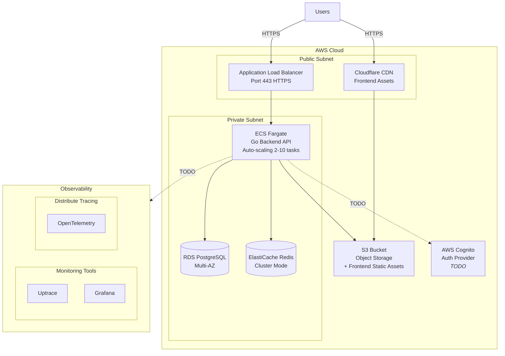
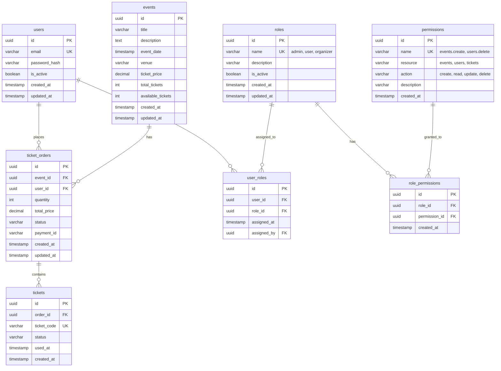

# Ticketing System - Architecture Documentation

> **Project Goal:** Create a scalable, maintainable architecture scaffold for a live events ticketing system that demonstrates production-ready patterns


---

## Table of Contents

1. [System Overview](#system-overview)
2. [Architecture Diagrams](#architecture-diagrams)
3. [Technology Stack](#technology-stack)
4. [Trade-offs](#trade-offs)
5. [Deployment Strategy](#deployment-strategy)
6. [Security Considerations](#security-considerations)
7. [Scalability Considerations](#scalability-considerations)


---

## System Overview

The ticketing system is designed as a **modern web application** with clear separation between frontend, backend, and infrastructure layers. The architecture supports both **local development** (Docker Compose) and **cloud deployment** (AWS via Terraform).

### Core Features

* **Authentication & Authorization** - JWT-based with role-based access control (user/admin)
* **Event Management** - Public event listings with detailed views
* **Ticket Purchasing** - Protected ticket purchase flow with inventory management
* **User Management** - CRUD operations with role-based permissions

### Key Architectural Principles

1. **Layered Architecture** - Clear separation: Handlers → Services → Repositories
2. **Stateless Backend** - Horizontal scaling capability via JWT (no session storage)
3. **Infrastructure as Code** - Repeatable deployments via Terraform
4. **Containerization** - Consistent environments from dev to production
5. **Security by Design** - Authentication, authorization, and secure defaults


---

## Architecture Diagrams

> Using **4+1 Architectural View Model** to describe the system from different perspectives.

### 1. Logical View - System Context



**Legend:** Solid lines = Implemented, Dashed lines = Stubbed/TODO

---

### 2. Logical View - Component Architecture



**Patterns used:**
- Dependency Injection for services
- Repository pattern for data access
- Middleware chain for cross-cutting concerns

---

### 3. Process View - Authentication Flow




---

### 4. Process View - Ticket Purchase Flow




---

### 5. Development View - Deployment

#### Local Development Environment



**Command:**

```bash
docker-compose up
```

**Access:**
- Frontend: http://localhost:5173
- Backend API: http://localhost:8080
- MinIO Console: http://localhost:9001

---

#### Cloud Production Environment (AWS)



**AWS Services:**
- ECS Fargate - Serverless containers with auto-scaling
- RDS PostgreSQL - Multi-AZ managed database with automated backups
- ElastiCache Redis - Cluster mode cache for sessions and data
- S3 - Static assets (frontend) + object storage (tickets/assets)
- Cloudflare CDN - Global distribution with DDoS protection
- ALB - Application Load Balancer with health checks
- VPC - Network isolation with public/private subnets
- NAT Gateway - Outbound internet access for private subnets
- Internet Gateway - Inbound/outbound traffic routing
- Security Groups - Firewall rules with least-privilege access
- IAM Roles - ECS task roles for S3 access (no hardcoded credentials)
- CloudWatch Logs - Centralized logging and monitoring

> **Detailed infrastructure documentation**: See [`README.md`](../README.md#services-overview) for local development setup and [`infra/README.md`](../infra/README.md) for complete infrastructure automation.

---

### 6. Data View - Entity Relationship Diagram



**RBAC (Role-Based Access Control) Design:**

The system uses a flexible RBAC model with separate tables for roles and permissions:

1. **User-Role Assignment:**
   - `user_roles` - Junction table enabling many-to-many relationship
   - Users can have multiple roles (e.g., user + organizer)

2. **Role-Permission Model:**
   - `roles` - Master data for system roles (admin, user, organizer, etc.)
   - `permissions` - Granular permissions following resource.action naming (e.g., `events.create`, `users.delete`)
   - `role_permissions` - Junction table mapping permissions to roles
   - Allows dynamic permission updates without code changes

**Ticket purchase mechanism:**
1. **Availability tracking:**
   - `events.total_tickets` - Original capacity
   - `events.available_tickets` - Current inventory (decremented on order, not ticket generation)
   - Inventory management decoupled from ticket generation

2. **Order and ticket states:**
   - `ticket_orders.status`: `pending`, `paid`, `confirmed`, `cancelled`, `refunded`
   - `tickets.status`: `valid`, `used`, `cancelled`, `transferred`
   - Payment processed at order level, not individual tickets

**Constraints:**

*Users & Auth:*
- `users.email` - Unique constraint
- `user_roles.user_id` - Foreign key with ON DELETE CASCADE
- `user_roles.role_id` - Foreign key with ON DELETE RESTRICT
- `user_roles.assigned_by` - Foreign key to users(id), nullable
- Composite unique: `(user_id, role_id)` - Prevent duplicate role assignments

*Roles & Permissions:*
- `roles.name` - Unique constraint
- `permissions.name` - Unique constraint
- `role_permissions.role_id` - Foreign key with ON DELETE CASCADE
- `role_permissions.permission_id` - Foreign key with ON DELETE CASCADE
- Composite unique: `(role_id, permission_id)` - Prevent duplicate permission assignments

*Tickets & Orders:*
- `ticket_orders.event_id` - Foreign key with ON DELETE RESTRICT
- `ticket_orders.user_id` - Foreign key with ON DELETE CASCADE
- `tickets.order_id` - Foreign key with ON DELETE CASCADE
- `tickets.ticket_code` - Unique constraint (generated when ticket created)
- Check constraint: `events.available_tickets >= 0`
- Check constraint: `ticket_orders.quantity > 0`

---

## Technology Stack

### Backend Stack

| Component | Technology | Rationale |
|----|----|----|
| **Language** | Go | Strong concurrency (goroutines), small binaries (\~20MB), fast compilation, excellent for high-throughput APIs |
| **Web Framework** | Gin | Fast HTTP router , built-in validation, middleware ecosystem, minimal overhead |
| **Database** | PostgreSQL | ACID compliance for ticket transactions, row-level locking prevents double-booking, rich query capabilities |
| **Cache** | Redis | In-memory cache for event listings, session data (future), rate limiting capability |
| **Database Client** | sqlx | Light wrapper over database/sql with struct scanning, not a full ORM (keeps SQL visible) |
| **Migrations** | golang-migrate | Database-agnostic, CLI tool, supports up/down migrations |
| **Auth** | golang-jwt/jwt | JWT generation and validation, industry standard |
| **Environment Config** | godotenv | Load .env files for local development |
| **Logging** | zerolog | Zero-allocation JSON logger, structured logging, high performance, minimal overhead |
| **Build Tool** | Makefile | Task automation for builds, tests, migrations, and Docker operations |
| **Testing/Mocking** | mockery | Auto-generate mocks from interfaces for unit testing, type-safe test doubles |

### Frontend Stack

| Component | Technology | Rationale |
|----|----|----|
| **Framework** | React | Industry standard, large ecosystem, well-understood by most developers |
| **Build Tool** | Vite | Fast HMR (Hot Module Replacement), modern ESM-based, smaller bundles than Webpack |
| **Language** | TypeScript | Type safety reduces runtime errors, pairs well with Go's strong typing |
| **Router** | React Router | Standard routing solution, supports protected routes |
| **HTTP Client** | Axios | Interceptors for auth token injection, better error handling than fetch |
| **State Management** | Context API | Sufficient for auth state, avoids Redux complexity for scaffold |

### Infrastructure Stack

| Component | Local (Docker) | Cloud (AWS) | Rationale |
|----|----|----|----|
| **Compute** | Docker Container | ECS Fargate | Serverless containers, auto-scaling, no EC2 management |
| **Database** | PostgreSQL Container | RDS PostgreSQL | Managed service, automated backups, Multi-AZ for HA |
| **Cache** | Redis Container | ElastiCache Redis | Managed Redis, cluster mode for scalability |
| **Object Storage** | MinIO | S3 | S3-compatible locally, production-ready globally-distributed storage |
| **CDN** | - | Cloudflare | Global CDN with DDoS protection, HTTPS termination |
| **Load Balancer** | - | ALB | Health checks, SSL termination, and auto-scaling integration |
| **IaC** | Docker Compose | Terraform | Infrastructure as Code, repeatable deployments |


---

## Trade-offs

### Decisions Made

| Decision | Benefit | Cost | Mitigation |
|----|----|----|----|
| **JWT (Stateless)** | Horizontal scaling, no session store | Cannot revoke tokens | Short TTL (24h) + refresh tokens (future) |
| **Docker Compose** | Easy local dev, environment parity | Requires Docker install (\~1GB) | Docker is industry standard, acceptable |
| **Gin Framework** | Fast, built-in features | Slightly opinionated | Still lightweight, easy to swap if needed |
| **Postgres (not NoSQL)** | Strong consistency, ACID | Complex setup vs. MongoDB | Necessary for ticket transactions |


---

## Deployment Strategy

### Local Development

Prerequisites: Docker Desktop + Git

**Setup:**
```bash
git clone <repository-url>
cd ticketing-system
docker-compose up
```

**Teardown:**
```bash
docker-compose down -v
```

---

### Cloud Deployment (AWS)

Prerequisites: AWS account + AWS CLI + Terraform

**Setup:**
```bash
cd infra/terraform
terraform init
terraform plan
terraform apply
```

**Provisioned resources:**
- VPC with public/private subnets
- ECS Fargate cluster with auto-scaling
- RDS PostgreSQL (Multi-AZ)
- ElastiCache Redis
- S3 bucket + Cloudflare CDN
- Application Load Balancer
- Security groups

**Teardown:**
```bash
terraform destroy
```


---

## Security Considerations

### Current Implementation

1. **Authentication:** JWT-based (token in localStorage)
2. **Authorization:** RBAC with separate roles, permissions, and user_roles tables
3. **Environment:** Variables for secrets (`.env`)
4. **CORS:** Configured for frontend origins

### RBAC Implementation Details

**Authorization Flow:**
```
1. User authenticates → JWT token issued with user_id
2. Request hits protected endpoint
3. Middleware extracts user_id from JWT
4. Query user's permissions via:
   user_roles → roles → role_permissions → permissions
5. Check if required permission exists
6. Allow/deny request
```


**Caching Strategy:**
- Cache user permissions in Redis (key: `user:{user_id}:permissions`)
- TTL: 15 minutes
- Invalidate on role/permission changes
- Reduces database queries on every request


### Production TODOs

**Network:**
- Deploy backend in private subnets only
- Use VPC security groups (least-privilege)
- Enable Cloudflare WAF rules for DDoS protection

**Database:**
- IAM database authentication
- Automated backups (7-day retention)
- Add indexes on user_roles and role_permissions for faster permission lookups

**Secrets:**
- Migrate to AWS Secrets Manager
- Implement secret rotation


**Input Validation:**
- Comprehensive sanitization (XSS, SQL injection)
- Rate limiting per user
- Validate permission names follow `resource.action` format

**Logging:**
- CloudWatch Logs for API requests
- CloudTrail for infrastructure changes
- Alerting on suspicious activity
- Log all permission checks (who accessed what, when)


---

## Scalability Considerations

### Current Design

1. **Stateless Backend** - JWT enables horizontal scaling
2. **Database** - Connection pooling, supports read replicas
3. **Caching** - Redis for frequently accessed data
4. **CDN** - Cloudflare for global static asset delivery

### Future Improvements

**Database:**
- Add read replicas for heavy queries
- Consider partitioning tickets table by date
- Sharding for multi-region (if needed)

**Backend:**
- Auto-scaling based on CPU/memory metrics
- Circuit breakers for external services

**Frontend:**
- Code splitting for faster initial load
- Lazy loading for routes

**Observability:**
- Distributed tracing with OpenTelemetry
- Metrics and monitoring via Grafana + Prometheus

**Migration Strategy:**
- Strangler Fig pattern for gradual microservice migration
- Start with event service as independent microservice
- Keep monolith as API gateway during transition


---

## References

* [Go Project Layout](https://github.com/golang-standards/project-layout) - Standard Go structure
* [4+1](https://medium.com/2b-1-better-2day/4-1-view-model-of-architecture-1a1794ff8110) - view model of architecture
