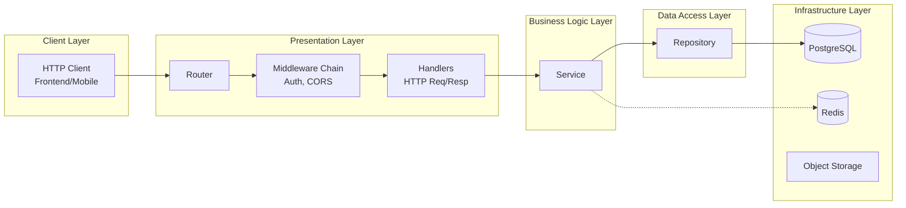
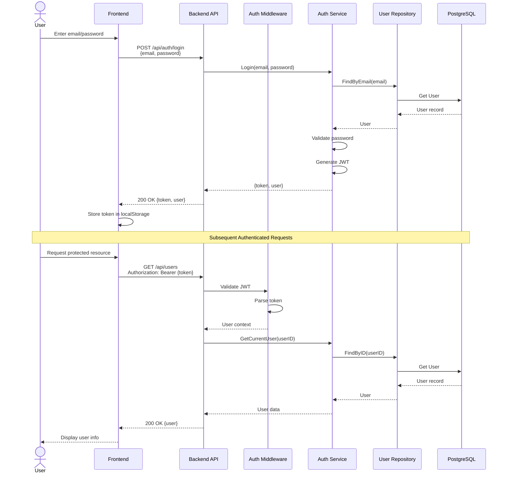
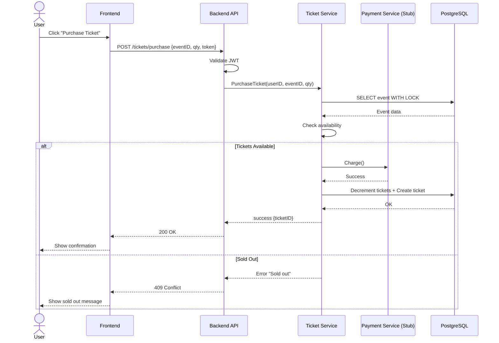
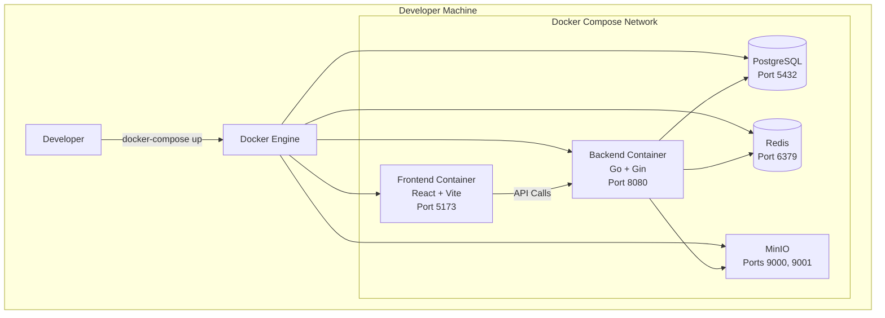
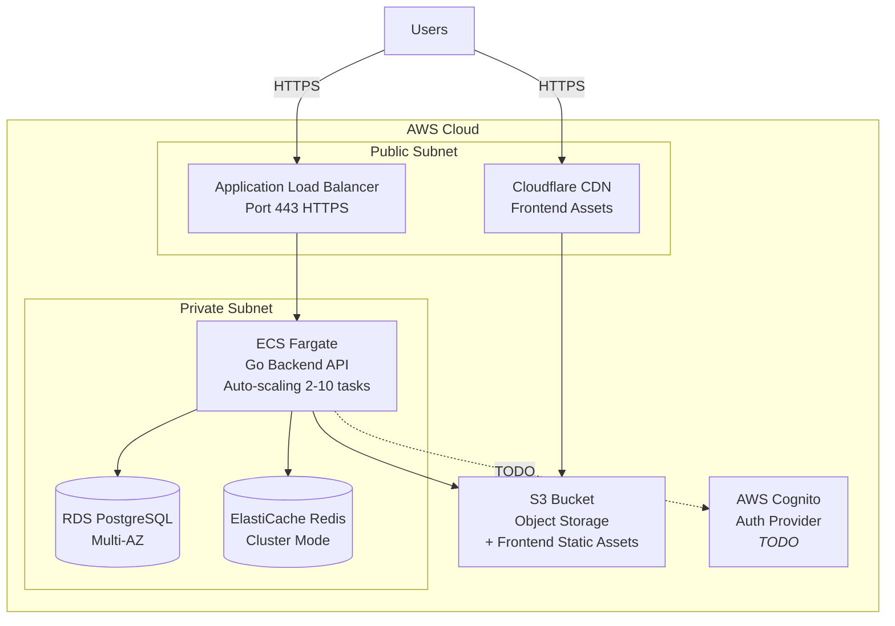

# Ticketing System - Architecture Documentation

> **Project Goal:** Create a scalable, maintainable architecture scaffold for a live events ticketing system that demonstrates production-ready patterns


## Table of Contents

1. [System Overview](#system-overview)
2. [Architecture Diagrams](#architecture-diagrams)

---

## System Overview

The ticketing system is designed as a **modern web application** with clear separation between frontend, backend, and infrastructure layers. The architecture supports both **local development** (Docker Compose) and **cloud deployment** (AWS via Terraform).

### Core Features

* **Authentication & Authorization** - JWT-based with role-based access control (user/admin)
* **Event Management** - Public event listings with detailed views
* **Ticket Purchasing** - Protected ticket purchase flow with inventory management
* **User Management** - CRUD operations with role-based permissions

### Key Architectural Principles

1. **Layered Architecture** - Clear separation: Handlers → Services → Repositories
2. **Stateless Backend** - Horizontal scaling capability via JWT (no session storage)
3. **Infrastructure as Code** - Repeatable deployments via Terraform
4. **Containerization** - Consistent environments from dev to production
5. **Security by Design** - Authentication, authorization, and secure defaults


---

## Architecture Diagrams

### 1. System Context (High-Level Architecture)


**Legend:** Solid lines = Implemented, Dashed lines = Stubbed/TODO

---

### 2. Backend Layered Architecture



**Patterns used:**
- Dependency Injection for services
- Repository pattern for data access
- Middleware chain for cross-cutting concerns

---

### 3. Authentication Flow (Sequence Diagram)




---

### 4. Ticket Purchase Flow (Sequence Diagram)




---

### 5. Deployment Architecture

#### Local Development Environment



**Command:**

```bash
docker-compose up
```

**Access:**
- Frontend: http://localhost:5173
- Backend API: http://localhost:8080
- MinIO Console: http://localhost:9001

---

#### Cloud Production Environment (AWS)



**AWS Services:**
- ECS Fargate - Serverless containers with auto-scaling
- RDS PostgreSQL - Managed database
- ElastiCache Redis - Managed cache
- S3 - Object storage + static assets
- Cloudflare CDN - Global distribution with DDoS protection
- ALB - Load balancer with health checks
- VPC - Network isolation

---

