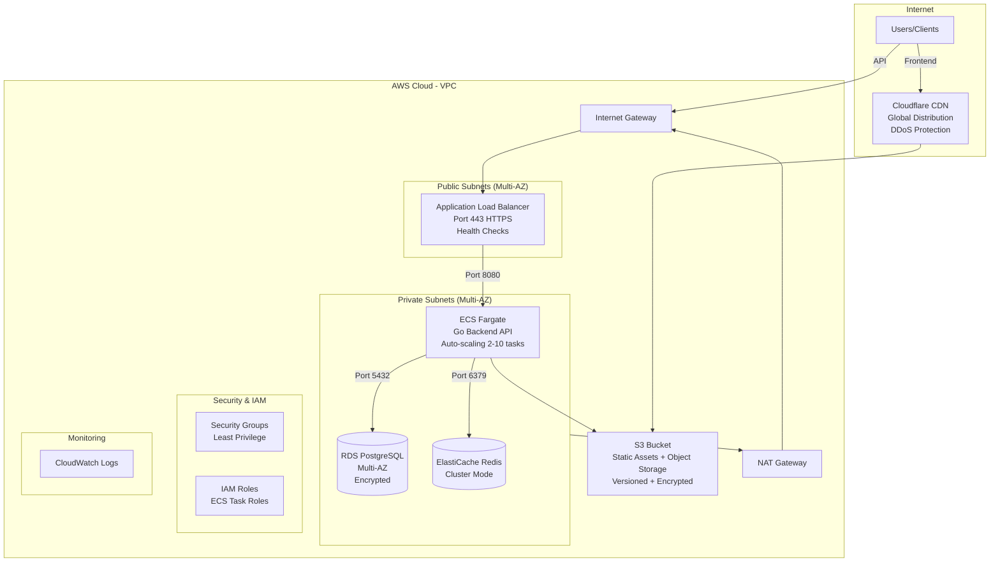

# Ticketing System - Infrastructure Automation

Complete Infrastructure-as-Code (IaC) for deploying the ticketing system to AWS using Terraform.

## Architecture Overview



## Features

**Security**
- VPC with public/private subnet isolation
- Security groups with least-privilege rules
- RDS and Redis in private subnets only
- S3 bucket encryption and no public access
- IAM roles for ECS tasks (no hardcoded credentials)

**Scalability**
- ECS Fargate auto-scaling (CPU/memory-based)
- Application Load Balancer for traffic distribution
- Multi-AZ deployment for high availability
- RDS with automated backups

**Extensibility**
- Modular Terraform structure
- Environment-specific configurations (dev, prod)
- CloudWatch logs integration

## Prerequisites

- **Terraform** >= 1.6.0
- **AWS CLI** >= 2.0
- AWS account with permissions for: VPC, ECS, RDS, ElastiCache, S3, IAM, CloudWatch, ALB

## Quick Start

### 1. Deploy Infrastructure

```bash
cd infra/scripts
./provision.sh dev
```

You'll be prompted for:
- Database password
- JWT secret

The script will:
1. Initialize Terraform
2. Validate configuration
3. Create execution plan
4. Deploy infrastructure

### 2. Get Outputs

```bash
cd ../terraform
terraform output
```

Key outputs:
- `alb_url` - Backend API endpoint
- `s3_bucket_name` - Object storage bucket
- `redis_endpoint` - Redis cache endpoint
- `db_endpoint` - Database connection (sensitive)

### 3. Verify Deployment

```bash
ALB_URL=$(terraform output -raw alb_url)
curl ${ALB_URL}/health
```

## Infrastructure Components

### Networking (`modules/networking/`)
- VPC with DNS support
- Public subnets (ALB)
- Private subnets (ECS, RDS, Redis)
- NAT Gateways for outbound traffic
- Security groups (ALB, ECS, RDS, Redis)

### Database (`modules/database/`)
- RDS PostgreSQL 16
- Private subnet deployment
- Automated backups (7-day retention)
- Multi-AZ support (prod)

### Cache (`modules/cache/`)
- ElastiCache Redis 7.0
- Private subnet deployment
- Session and data caching

### Storage (`modules/storage/`)
- S3 bucket with versioning
- AES-256 encryption
- Lifecycle rules (intelligent tiering)

### Compute (`modules/compute/`)
- ECS Fargate cluster
- Auto-scaling (2-10 tasks)
- Application Load Balancer
- IAM roles for S3 access
- CloudWatch logging

## Environment Management

### Development
```bash
./provision.sh dev
```
- 2 AZs
- db.t3.micro RDS
- 1 ECS task
- No deletion protection

### Production
```bash
./provision.sh prod
```
- 3 AZs (Multi-AZ)
- db.t3.small RDS
- 3 ECS tasks
- Deletion protection enabled


## Destroy Infrastructure

```bash
cd infra/scripts
./teardown.sh dev
```

**Warning**: Permanently deletes all resources. Type `destroy` to confirm.

## Directory Structure

```
infra/
├── terraform/
│   ├── main.tf              # Root module
│   ├── variables.tf         # Input variables
│   ├── outputs.tf           # Stack outputs
│   ├── modules/
│   │   ├── networking/      # VPC, subnets, security groups
│   │   ├── database/        # RDS PostgreSQL
│   │   ├── cache/           # ElastiCache Redis
│   │   ├── storage/         # S3 bucket
│   │   └── compute/         # ECS Fargate + ALB
│   └── environments/
│       ├── dev.tfvars       # Development config
│       └── prod.tfvars      # Production config
└── scripts/
    ├── provision.sh         # Deploy infrastructure
    └── teardown.sh          # Destroy infrastructure
```

## Testing Strategy

you can validate without real deployment:

```bash
cd infra/terraform
terraform init
terraform validate
terraform plan -var-file=environments/dev.tfvars
```

This validates your infrastructure code without incurring AWS costs.

---

**Next Steps**: After deployment, update backend `.env`:
- `DATABASE_URL` → Use RDS endpoint from terraform output
- `REDIS_URL` → Use Redis endpoint
- `MINIO_ENDPOINT` → s3.amazonaws.com
- `S3_BUCKET` → Use bucket name from terraform output
- `STORAGE_TYPE=s3`